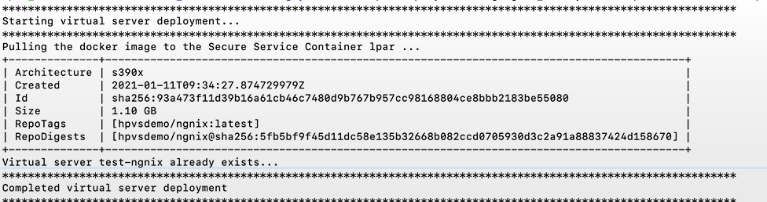

# Deploying your applications securely

This topic provides information about how you can deploy your own Linux-based container image as a Hyper Protect Virtual Server on the IBM Hyper Protect Virtual Servers.

## Prerequisites
The following are the prerequisites for being able to deploy your own image into the IBM Hyper Protect Virtual Servers:

* Ensure your Linux-based container image are built for the IBM LinuxONE and IBM Z platform (s390x architecture), and available on [DockerHub](https://docker.io){target=_blank}.

* Ensure your Linux-based container images are signed using [Docker Content Trust](https://docs.docker.com/engine/security/trust/content_trust/){target=_blank}. If not signed by using Docker Content Trust, follow the steps listed in [Sign your image by using Docker Content Trust](#step_1){target=_blank}.


Complete the following steps with root user authority.  

1. [Sign your image by using Docker Content Trust](#step_1)
2. [Adding the registry](#step_2)
3. [Generating the signing keys](#step_3)
4. [Preparing the configuration](#step_4)
5. [Deploy your image](#step_5)

### step_1  
**Sign your image by using Docker Content Trust**

Login to Docker hub using your Docker Hub credentials, if you are not logged-in yet.


???+ example "Example output"

   ```bash
   docker login
   Login with your Docker ID to push and pull images from Docker Hub. If you do not have a Docker ID, go to https://hub.docker.com to create one.
   Username: hpvsdemo
   Password:
   WARNING! Your password will be stored unencrypted in /root/.docker/config.json.
   Configure a credential helper to remove this warning. See
   https://docs.docker.com/engine/reference/commandline/login/#credentials-store
   Login Succeeded
   ```  

- Enable Docker Content Trust (DCT), specify the server for the Docker Content Trust service by running the following command.
  ```
  export DOCKER_CONTENT_TRUST=1
  export DOCKER_CONTENT_TRUST_SERVER=https://notary.docker.io
  ```

- Run the following command to load the image (Nginx application) from the DockerHub onto your management server.
   ```
   docker image pull <your_docker_id>/<result_image_name>:<tag>
   ```

    ??? example "Example output"

       ```bash
       docker image pull s390x/nginx:latest
       latest: Pulling from s390x/nginx
       405e75bf6bb0: Pull complete
       513ab99245be: Pull complete
       0057372a1eb7: Pull complete
       e8a2963860c1: Pull complete
       ed9d8c330029: Pull complete
       Digest: sha256:9b47e7c64b1f9149832d1ef7cbf9d80b9b55466a9c6c8212f30d15966fd9f1a6
       Status: Downloaded newer image for s390x/nginx:latest
       docker.io/s390x/nginx:latest
       ```


- Re-tag your docker images by running the following command. Build your Linux-based container image for s390x architecture by using a build tool such as `docker build`. For example, your source code is stored in a github repository and the result s390x architecture container image will be pushed to a remote Docker repository with DCT enabled.
   ```
   docker tag <your_docker_id>/<result_image_name>:<tag> <your_docker_id>/<result_image_name>:<new-tag>
   ```

    ??? example "Example output"

       ```bash
       docker tag s390x/nginx:latest hpvsdemo/hpvsdemo_secureapp:secureapp
       ```

- Push your images to the DockerHub by running the following command.
   ```
   docker push <your_docker_id>/<result_image_name>:<new-tag>
   ```

    ??? example "Example output"

       ```bash
       docker push hpvsdemo/hpvsdemo_secureapp:secureapp
       The push refers to repository [docker.io/hpvsdemo/hpvsdemo_secureapp]
       ac2dc34ad3c9: Mounted from hpvsdemo/secure_app_nginx_new
       b2ef6e716a0f: Mounted from hpvsdemo/secure_app_nginx_new
       cb2071142d0b: Mounted from hpvsdemo/secure_app_nginx_new
       b60202bb076f: Mounted from hpvsdemo/secure_app_nginx
       563b53cd7a3f: Mounted from hpvsdemo/secure_app_nginx_new
       secureapp: digest: sha256:9b47e7c64b1f9149832d1ef7cbf9d80b9b55466a9c6c8212f30d15966fd9f1a6 size: 1362
       Signing and pushing trust metadata
       Enter passphrase for root key with ID 1bec86a:
       Enter passphrase for root key with ID 1bec86a:
       Enter passphrase for new repository key with ID 3237039:
       Repeat passphrase for new repository key with ID 3237039:
       Finished initializing "docker.io/hpvsdemo/hpvsdemo_secureapp"
       Successfully signed docker.io/hpvsdemo/hpvsdemo_secureapp:secureapp
       ```

   Enter your root passphrase and repository passphrase when you are prompted to. The generated public key is stored in `~/.docker/trust/tuf/docker.io/<your_docker_id>/<result_image_name>/metadata/root.json`/


### step_2
**Adding the registry**

   Verify whether you already have a registry by running the following command.
   ```
   hpvs registry list
   ```
   If there are no registries displayed, then add a registry by running the following command.
   ```
   hpvs registry add --name registry_name --user <username> --dct https://notary.docker.io --url docker.io
   ```
   Where  
   name - Specify a name for your registry.  
   user - Docker registry username.

### step_3
**Generating the signing keys**

To generate the signing keys, follow the instructions listed in the topic [`Generating the signing keys`](gen_sign_key.md){target=_blank}.

### step_4
**Preparing the configuration**

- Create the configuration yaml `secure_create.yaml` file so that the repository registration file for your image can be generated. You can use the `$HOME/hpvs/config/securebuild/secure_create.yaml.example` example file as a reference when updating the file.    

??? example "Example of a secure_create.yaml file"

    ```
    repository_registration:
       docker:
          repo: 'hpvsdemo/nginx'
          pull_server: 'docker_reg'
          # this root.json you will get after once you will push image to DockerHub using Docker Content Trust
          content_trust_json_file_path: 'home/hpvs_user/HPVS1221_Production/config/yaml/demo/root.json'
       env:
          whitelist: ["ROOT_SSH_KEY","SERVER_KEY", "RUNQ_ROOTDISK", "LOGTARGET", "ROOTFS_LOCK"]
       signing_key:
       # complete path of signing private key
          private_key_path: '/home/hpvs_user/.ssh/hpvs_user/isv_user.private'
       # complete path of signing public key
          public_key_path: '/home/hpvs_user/.ssh/hpvs_user/isv_user.pub'.
    ```

**Note**: If you want to use your own image, see [Deploying your applications securely](https://www.ibm.com/support/knowledgecenter/SSHPMH_1.2.x/topics/byoi.html){target=_blank}, for instructions.

- Generate the repository registration file for your image.
   ```
   hpvs regfile create --config $HOME/hpvs/config/securebuild/secure_create.yaml --out $HOME/hpvs/config/encryptedRegfile.enc
   ```

??? example "Example of the command"

    ```
    hpvs regfile create --config secure_create.yaml --out Ngnix.enc
    ```


### step_5
**Deploy your image**

**Complete the following steps to deploy your own image by using the `hpvs deploy` command.**


<!--- Update the template file `$HOME/hpvs/config/templates/virtualserver.template.yml` based on the networking configuration, quotagroup and resource settings of the Hyper Protect Virtual Server instance if necessary. The `vs_regfiledeployexample.yml` that has the configuration details for the virtual server refers to the corresponding sections of the `virtualserver.template.yml` when you run the `hpvs deploy` command. For example, the `resourcedefinition: ref` value refers to the `resourcedefinitiontemplate` definition in the template file. The `network: ref` value refers to the `networktemplates` definition in the template file.

??? example "Example of a virtualserver-template file"

    ```
    version: v1
    type: virtualserver-template
    networktemplates:
    -  name: external_network
       subnet: "10.20.4.0/22"
       gateway: "10.20.4.1"
       parent: "encf900"
       driver: "macvlan"
    -  name: internal_network
       subnet: "192.168.40.0/24"
       gateway: "192.168.40.1"
       parent: "encf900"
       driver: "bridge"
    quotagrouptemplates:
    # Passthrough quotagroup templates - A quotagroup will be dynamically created based
    # on the template and attached as single volume mount point to the virtual server.
    # Allowed filesystem types for the passthrough type quogagroup are btrfs, ext4, xfs
    -  name: p-small
       size: 20GB
       filesystem : ext4
       passthrough: true
    -  name: p-medium
       size: 50GB
       filesystem : ext4
       passthrough: true
    -  name: p-large
       size: 100GB
       filesystem : ext4
       passthrough: true
    -  name: p-xlarge
       size: 200GB
       filesystem : ext4
       passthrough: true
    -  name: p-xxlarge
       size: 400GB
       filesystem : ext4
       passthrough: true
    # Non passthrough quotagroup definitions - This quotagroups can be shared by
    # creating multiple volume mountpoints with the same virtual server or multiple
    # virtual server.  A non passthrough quotagroup will be dynamically created based
    # on the template and attached as volume mount points to the virtual server.
    # Only brtfs filesystem is supported in non passthrough quotagroups
    # mount points attached to virtual server can have filesystem btrfs, ext4, xfs
    -  name: np-small
       size: 20GB
       passthrough: false
    -  name: np-medium
       size: 50GB
       passthrough: false
    -  name: np-large
       size: 100GB
       passthrough: false
    -  name: np-xlarge
       size: 200GB
       passthrough: false
    -  name: np-xxlarge
       size: 400GB
       passthrough: false
    resourcedefinitiontemplates:
    -  name: default
       cpu: 1
       memory: 4096
    -  name: small
       cpu: 2
       memory: 6192
    -  name: large
       cpu: 4
       memory: 8192
    -  name: xl
       cpu: 8
       memory: 16656
    -  name: xxl
       cpu: 12
       memory: 32565   
    ```
    -->

- Create the configuration yaml file by the name "nginx_demo_byoi.yml"

??? example "Example of the nginx_demo_byoi.yml file"

    ```
    version: v1
    type: virtualserver
    virtualservers:
    - name: test-nginx
      host: test2
      repoid: Nginx
      imagetag: latest
      reporegfile: /home/hpvs_user/HPVS1221_Production/config/yaml/demo/Nginx.enc
      resourcedefinition:
         ref: small
      networks:
      # - ref:  external_network
      #  ipaddress: 129.40.15.20
      environment:
      - key: LOGTARGET
      - value: /dev/console
      - key: ROOTFS_LOCK
      - value: Y
      - key: ROOT_SSH_KEY
      - value: '@/home/hpvs_user/.ssh/id-rsa'
      - key: RUNQ_ROOTDISK
      - value: new_qg_nginx
      volumes:
      - mounts:
      - filesystem: ext4
        mount_id: new_qg_nginx
        mountpoint: /newroot         
        size: 10GB
      - filesystem: ext4
        mount_id: data
        mountpoint: /data        
        size: 10GB
       - name: qg_hpvs_nginx
         ref : np-medium

    ```

- Deploy the image by using the configurations in the yaml file.  
   ```
   hpvs deploy --config $HOME/hpvs/config/demo_byoi.yml
   ```

??? example "Example of the command"

       ```
       hpvs deploy --config nginx_demo.yml
       ```

??? example "Example output"
   

- You can update the resources or configuration of a virtual server after the completion of the deploy operation by using the `-u`, or the `--update` flag of the `hpvs deploy` command. For more information about this command, see [`Updating virtual servers`](../reference/hpvs_update.md){target=_blank}. 
