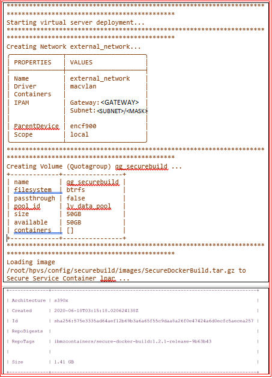

# Create your Secure Build Server using yaml file

You can create the Secure Build virtual server by using the `hpvs deploy` command by specifying a configuration yaml file as an input for the `hpvs deploy` command.

1. See the topic [`Create your Secure Build Server`](create-server.md){target=_blank} for details about the certificate generation.

2. Update the template file `$HOME/hpvs/config/templates/virtualserver.template.yml` based on the networking configuration, quotagroup, and resource settings of the Hyper Protect Virtual Server instance if necessary.

    ??? example "Example of a virtualserver-template file"

    ```
    version: v1
    type: virtualserver-template
    networktemplates:
    -  name: external_network
       subnet: "10.20.4.0/22"
       gateway: "10.20.4.1"
       parent: "encf900"
       driver: "macvlan"
    -  name: internal_network
       subnet: "192.168.40.0/24"
       gateway: "192.168.40.1"
       parent: "encf900"
       driver: "bridge"
    quotagrouptemplates:
    # Passthrough quotagroup templates - A quotagroup will be dynamically created based
    # on the template and attached as single volume mount point to the virtual server.
    # Allowed filesystem types for the passthrough type quogagroup are btrfs, ext4, xfs
    -  name: p-small
       size: 20GB
       filesystem : ext4
       passthrough: true
    -  name: p-medium
       size: 50GB
       filesystem : ext4
       passthrough: true
    -  name: p-large
       size: 100GB
       filesystem : ext4
       passthrough: true
    -  name: p-xlarge
       size: 200GB
       filesystem : ext4
       passthrough: true
    -  name: p-xxlarge
       size: 400GB
       filesystem : ext4
       passthrough: true
    # Non passthrough quotagroup definitions - This quotagroups can be shared by
    # creating multiple volume mountpoints with the same virtual server or multiple
    # virtual server.  A non passthrough quotagroup will be dynamically created based
    # on the template and attached as volume mount points to the virtual server.
    # Only brtfs filesystem is supported in non passthrough quotagroups
    # mount points attached to virtual server can have filesystem btrfs, ext4, xfs
    -  name: np-small
       size: 20GB
       passthrough: false
    -  name: np-medium
       size: 50GB
       passthrough: false
    -  name: np-large
       size: 100GB
       passthrough: false
    -  name: np-xlarge
       size: 200GB
       passthrough: false
    -  name: np-xxlarge
       size: 400GB
       passthrough: false
    resourcedefinitiontemplates:
    -  name: default
       cpu: 1
       memory: 4096
    -  name: small
       cpu: 2
       memory: 6192
    -  name: large
       cpu: 4
       memory: 8192
    -  name: xl
       cpu: 8
       memory: 16656
    -  name: xxl
       cpu: 12
       memory: 32565   
    ```

3. Create the configuration yaml file $HOME/hpvs/config/securebuild/demo_securebuild.yml for the instance by referring to the example file $HOME/hpvs/config/securebuild/vs_securebuild.yml. The `vs_securebuild.yml` has the configuration details for the virtual server and refers to the corresponding sections of the `virtualserver.template.yml` when you run the `hpvs deploy` command. For example, the `resourcedefinition: ref` value refers to the `resourcedefinitiontemplate` definition in the template file. The `network: ref` value refers to the `networktemplates` definition in  the template file.   


    ??? example "Example of a Secure Build virtual server configuration file"

    ```
    version: v1
    type: virtualserver
    virtualservers:
    - name: securebuildserver
      host: SSC_LPAR_NAME
      repoid: SecureDockerBuild
      imagetag: 1.2.2.1-release-4dbd783
      imagefile: SecureDockerBuild.tar.gz
      resourcedefinition:
         ref: small
      environment:
       - key: ROOTFS_LOCK
         value: "y"
       - key: CLIENT_CRT
         value: "@/root/hpvs/config/securebuild/keys/sbs_base64.cert" # provide certificate file in base64 format
       - key: RUNQ_ROOTDISK
         value: newroot
      networks:
       - ref:  external_network
         ipaddress: 10.20.4.67
      volumes:
       - name: securebuild_qg
         ref: np-medium
      mounts:
       - mountpoint: /data
         filesystem: ext4
         size: 16GB
         mount_id: data
       - mountpoint: /docker
         filesystem: ext4
         size: 16GB
         mount_id: docker
       - mountpoint: /newroot
         filesystem: ext4
         size: 10GB
         mount_id: newroot
         reset_root: false
    ```


4. Create the Secure Build virtual server by using the configurations in the yaml file.  
     ```
     hpvs deploy --config $HOME/hpvs/config/securebuild/demo_securebuild.yml
     ```

    ??? example "Example output"
        


Your secure build server is now up and running. It is available at the IP Address of the Hyper Protect Virtual Server LPAR and port (GuestPort) specified. You will use this secure build server to securely build your application in the next section.

**Note**: You can use the `hpvs undeploy` command to delete this virtual server. This command is supported in Hyper Protect Virtual Servers version 1.2.2, or later. For more information, see [`Undeploying virtual servers`](../reference/hpvs_undeploy.md){target=_blank}.
- You can update the resources or configuration of a virtual server after the completion of the deploy operation by using the `-u`, or the `--update` flag of the `hpvs deploy` command. The information about the parameters to be updated are read from the configuration yaml file. You can edit the configuration file with the details of the update you want to perform and use this configuration file to run the command. This flag is applicable for Hyper Protect Virtual Servers version 1.2.2, or later. Run the following command to update the virtual server instance.
```
hpvs deploy --update --config $HOME/hpvs/config/demo_byoi.yml
```
When you have a large number of virtual servers to update, you can use the following flags to simplify the deploy update operation.
* `--exclude`: To exclude virtual servers from the deploy update operation. You can specify a single virtual server, or a comma separated list of virtual servers.
* `--include`: To include the virtual servers from the deploy update operation. You can specify a single virtual server, or a comma separated list of virtual servers.
* If you do not use the `--exclude` or `--include` flag, all virtual servers that are listed in the configuration yaml file are updated. The `--exclude` or `--include` flags are mutually exclusive and you must specify only one of them when you run the `hpvs deploy`  command along with the `--update` flag.

You can use the `--update` flag of the `hpvs deploy` command in the following scenarios:    
- Increase the size of the mountpoint (you might need to increase the size of the quotagroup to accommodate the increase in mountpoint size).
- Update the repository definition file.
- Update the network by modifying the network config section in configuration yaml file. If the network not exist, a new network can be created with the specified details. Similarly, you can change an existing IP address.      

You cannot use the `--update` flag of the `hpvs deploy` command in the following scenarios:  
- Add a new mount ID, reduce the size of the mountpoint or reduce the size of the quotagroup.  
- Detach a quotagroup (you cannot detach a quotagtoup by using the `hpvs vs update` command as well). Doing so might cause errors or lead to an irrecoverable state of the quotagroup and the virtual server.  


**Note**:   
* Networks that are detached when you run the `hpvs deploy` command by specifying the `--update` flag, are deleted if they not used by any other virtual server.  
* You cannot update the settings of an existing network in the virtual server template file.


!!! note
    You can assign IP addresses and hostnames for containers as necessary for your purposes but using the docker network and host ports is a nice way to quickly get running without having to use up IP addresses on your network.
