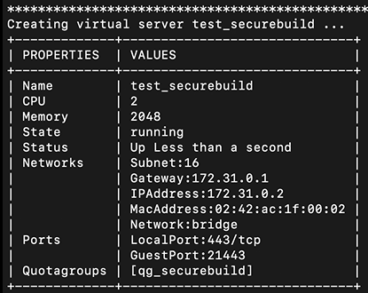
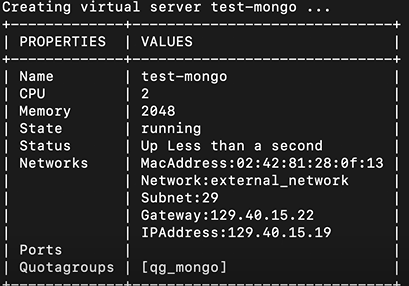
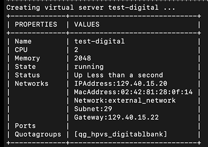

# Creating the Secure Build Server

You can create the Secure Build virtual server by using the `hpvs deploy` command by specifying a configuration yaml file as an input for the `hpvs deploy` command. This is the recommended option to provision the instance because of it's ease of use, and is also an easier method of creating multiple instances quickly.

You can also use the `hpvs vs create` command to create the virtual server, however this method requires you to enter several configuration information using multiple commands. For more information about this method, see [Create a virtual server by using the hpvs image and hpvs vs create commands](https://www.ibm.com/docs/en/hpvs/1.2.x?topic=later-building-your-application-secure-build-virtual-server#using-hpvs_create). 

## Prerequisites
Before you start the Secure Build process, you must create the certificate and key to securely communicate with Secure Build Server. Complete the following steps.

1. Run the following command.
   ```
   cd $HOME/hpvs/config/securebuild/keys
   ```

2. Create the certificate and key to securely communicate with Secure Build Server.
   ```
   openssl req -newkey rsa:2048 \
   -new -nodes -x509 \
   -days 3650 \
   -out sbs.cert \
   -keyout sbs.key \
   -subj "/C=GB/O=IBM/CN=johndoe.example.com"
   ```

    !!! note

       If you see errors like `random number generator:RAND_load_file:Cannot open file`, then run the following commands.
       ```
       openssl rand -out $HOME/.rnd -hex 256
       ```

3. Run the following command to change the certificate to base64 encoding.
   ```
   echo $(cat sbs.cert | base64) | tr -d ' ' >> sbs_base64.cert
   ```


## Procedure to create a Secure Build virtual server (for building the MongoDB image)

1. Create the configuration yaml file `securebuild.yml` for the instance by referring to the example file $HOME/hpvs/config/securebuild/vs_securebuild.yml. The `vs_securebuild.yml` has the configuration details for the virtual server and refers to the corresponding sections of the `virtualserver.template.yml` when you run the `hpvs deploy` command. For example, the `resourcedefinition: ref` value refers to the `resourcedefinitiontemplate` definition in the template file.    


    ??? example "Example of a Secure Build virtual server configuration file"

        ```
        version: v1
        type: virtualserver
        virtualservers:
        - name: test_securebuild
          host: test2
          repoid: SecureDockerBuild
          imagetag: 1.2.3-release-f78a642
          imagefile: /home/hpvs_user/hpvs/config/securebuild/images/SecureDockerBuild.tar.gz
          resourcedefinition:
             ref: small
          environment:
           - key: ROOTFS_LOCK
             value: "y"
           - key: CLIENT_CRT
             value: "@/home/hpvs_user/hpvs/config/securebuild/keys/sbs_withbase64.cert" # provide certificate file in base64 format
           - key: RUNQ_ROOTDISK
             value: newroot
          ports:
           - containerport: 443
             protocol: tcp   
             hostport: 21443
          volumes:
           - name: qg_securebuild
             ref: np-medium
          mounts:
           - mountpoint: /data
             filesystem: ext4
             size: 16GB
             mount_id: data
           - mountpoint: /docker
             filesystem: ext4
             size: 16GB
             mount_id: docker
           - mountpoint: /newroot
             filesystem: ext4
             size: 10GB
             mount_id: newroot
             reset_root: false
        ```
        This Secure Build virtual server is used to build the MongoDB image.

        **Note**: You can view the example configuration files at `home/hpvs_user/HPVS1221_Production/config/yaml`.

2. Create the Secure Build virtual server by using the configurations in the yaml file.  
     ```
     hpvs deploy --config $HOME/hpvs/config/securebuild/securebuild.yaml --templatefile ../../templates/virtualserver.template.yml
     ```

    ??? example "Example of the command"

        ```
        hpvs deploy --config $HOME/hpvs/config/securebuild/securebuild.yaml --templatefile ../../templates/virtualserver.template.yml
        ```

Your Secure Build Server is now up and running. It is available at the IP Address of the Hyper Protect Virtual Server LPAR and port (GuestPort) specified. This Secure Build virtual Server will be used to build the MongoDB image.


???+ example "Example Output"
    


## Procedure to create the MongoDB virtual server

You will follow the same steps as mentioned in the section: Procedure to create a Secure Build virtual server (for building the MongoDB image), but use a configuration file that specifies the details that are required for the MongoDB virtual server. To run the digital banking application, the digital virtual server requires the MongoDB virtual to be up and running already.

1. Create the configuration file `mongo_demo.yml` for the MongoDB virtual server by referring to the example `vs_configfile_readme.yaml` available in `$HOME/home/hpvs/config`.
 The following is an example of the configuration file:

    ??? example "mongo_demo.yml"

         ```
         version: v1
         type: virtualserver
         virtualservers:
         - name: test_mongo
           host: test2
           repoid: mongodemo
           imagetag: latest
           imagefile: /home/hpvs_user/hpvs/config/securebuild/regfiles/encryptedRepoRegistration_mongo.enc
           resourcedefinition:
              ref: small
           networks:
           - ref: external_network
             ipaddress: 129.40.15.19
           volumes:
            - name: qg_securebuild
              ref: np-medium
              mounts:
              - mount_id: data
                mountpoint: /data
                filesystem: ext4
                size: 10GB
         ```

    !!! tip
        Step 3 of "Procedure to create the MongoDB image" from the topic [`Securely Build your Application`](build.md){target=_blank} generates the encrypted registration file `encryptedRepoRegistration_mongo.enc` that is used in the above example yaml file. You can view the example configuration files at `home/hpvs_user/HPVS1221_Production/config/yaml`.


2. Create the MongoDB virtual server by using the configurations in the yaml file (in this step, the MongoDB image is pulled from DockerHub).

     ```
     hpvs deploy --config $HOME/hpvs/config/vs_configfile_readme.yml --templatefile ../../templates/virtualserver.template.yml
     ```

    ??? example "Example of the command"

        ```
        hpvs deploy --config $HOME/hpvs/config/mongo_demo.yml --templatefile ../../templates/virtualserver.template.yml
        ```


    ???+ example "Example Output"
        


## Procedure to create a Secure Build virtual server (for building the digital banking application image)

You can use the same configuration file that had you created earlier for deploying the Secure Build virtual server by deleting the virtual server that was created (test_securebuild), and running the same steps as listed in the section: Procedure to create a Secure Build virtual server (for building the MongoDB image). The Secure Build virtual server thus created is used to build the digital banking application image.    

Alternatively, you can also create another configuration file with the details of the Secure Build Server and create another virtual server, and use this virtual server to build the digital banking application image.


## Procedure to create the digital virtual server

You will follow the same steps as mentioned in the section: Procedure to create a Secure Build virtual server (for building the MongoDB image), but use a configuration file that specifies the details that are required for the digital virtual server.

1. Create the configuration file for the digital application virtual server by referring to the example `vs_configfile_readme.yaml` available in `$HOME/home/hpvs/config`. This following is an example of the configuration file:

    ??? example "digital_demo.yml"

         ```
         version: v1
         type: virtualserver
         virtualservers:
         - name: test_digital
           host: test2
           repoid: mongodemo
           imagetag: latest
           imagefile: /home/hpvs_user/hpvs/config/securebuild/regfiles/encryptedRepoRegistration_digital.enc
           resourcedefinition:
              ref: small
           networks:
           - ref: external_network
             ipaddress: 129.40.15.20
           environment:
           - key: LOGTARGET
             value: /dev/console
           - key: ROOTFS_LOCK
             value: "y"
           - key: ROOT_SSH_KEY
             value: '@/home/hpvs_user/.ssh/id_rsa'
           - key: RUNQ_ROOTDISK
             value: new_qg_digitalbank         
           volumes:
            - mounts:
              - filesystem: ext4
                mount_id: new_qg_digitalbank
                mountpoint: /newroot
                size: 10GB
              - filesystem: ext4
                mount_id: data
                mountpoint: /data
                size: 10GB
              name: qg_hpvs_digitalbank
              ref: np-medium
         ```


         **Note**: You can view the example configuration files at `home/hpvs_user/HPVS1221_Production/config/yaml`.

2. Create the digital application virtual server by using the configurations in the yaml file (in this step, the digital banking application image is pulled from DockerHub).

     ```
     hpvs deploy --config $HOME/hpvs/config/vs_configfile_readme.yml  --templatefile ../../templates/virtualserver.template.yml
     ```

    ??? example "Example of the command"

        ```
        hpvs deploy --config $HOME/hpvs/config/digital_demo.yml  --templatefile ../../templates/virtualserver.template.yml
        ```


    ???+ example "Example Output"
        


!!! note

       - You can assign IP addresses and hostnames for containers as necessary for your purposes but using the docker network and host ports is a nice way to quickly get running without having to use up IP addresses on your network.
       - You can use the `hpvs undeploy` command to delete a virtual server. For more information, see [`Undeploying virtual servers`](../reference/hpvs_undeploy.md){target=_blank}.  
       - You can update the resources or configuration of a virtual server after the completion of the deploy operation by using the `-u`, or the `--update` flag of the `hpvs deploy` command. For more information, see [`Updating virtual servers`](../reference/hpvs_update.md){target=_blank}.
