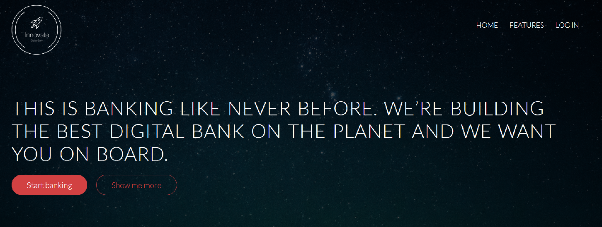

# Welcome to the Digital Banking Application

## Overview

This application is a secure application found at [this GitHub repository](https://github.com/hpvshostedtrail2022/bank_App/tree/mongo_sbs){target=_blank}. This application is built for your smartphone, it updates your balance instantly, sends intelligent notifications, and is actually easy to use.  While this application is a dummy digital bank created for demo purposes, running this type of application on Hyper Protect enables you to protect your digital assets from bad actors such as malicious server administrators.

!!! info
    This application inherits the security benefits of the Hyper Protect Virtual Server platform. This ensures that a legitimate version of the application is running (Secure Image Build process) and that administrators cannot compromise the application (Hyper Protect Virtual Server deployment).

## Accessing the application
You can click the following link to start using the application:
https://129.40.15.20:3100/index.html

 

  You can explore the Digital Banking application before moving on.
